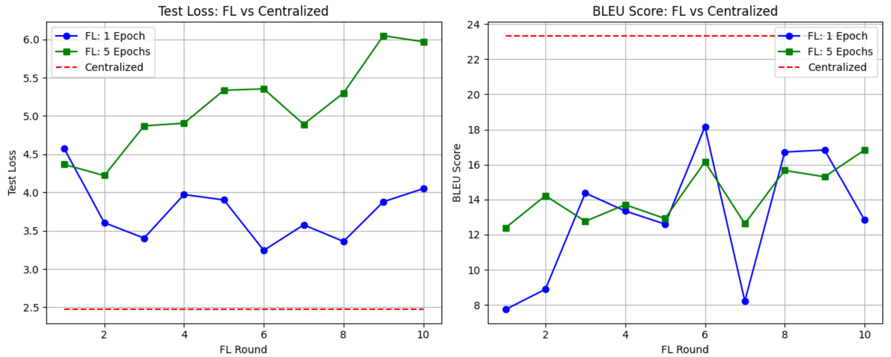
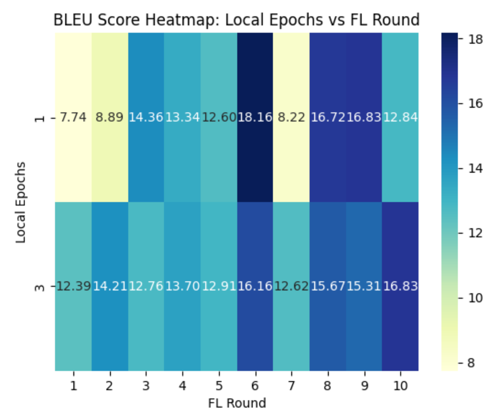
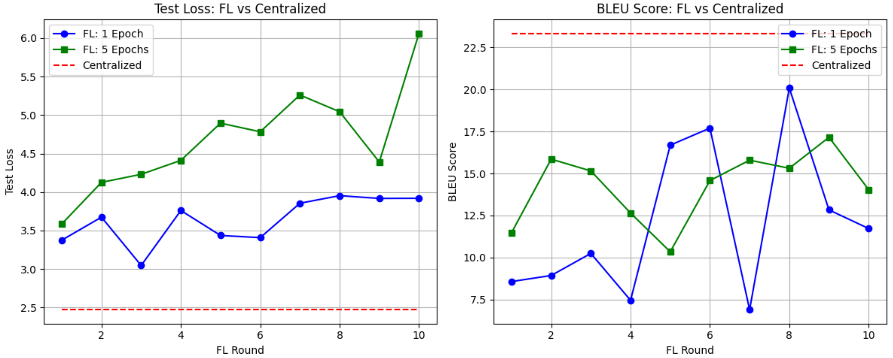
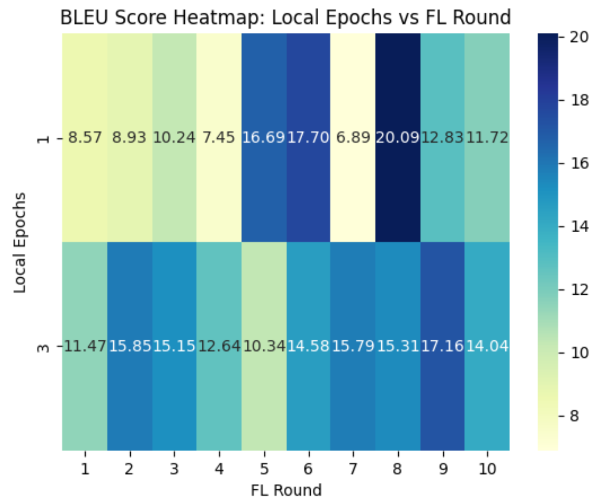
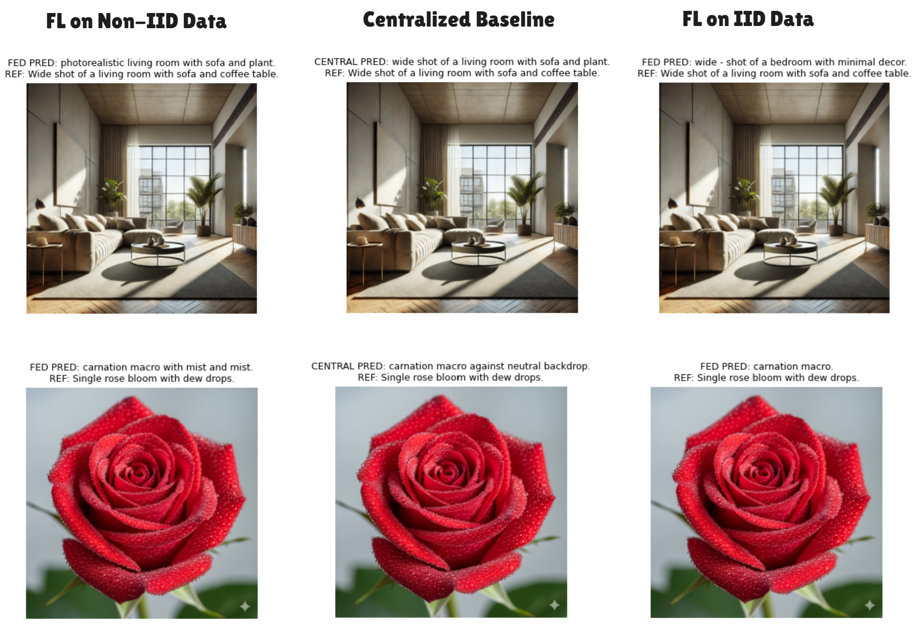

# Federated Learning for Image Captioning (IID vs Non-IID)

## 📌 Project Overview
This project explores **federated learning (FL)** using the **BLIP model** for image captioning by simulating multiple clients with **IID** and **Non-IID** partitions to evaluate performance, convergence, and communication trade-offs.

Colab link: https://colab.research.google.com/drive/1mQrmNuKlRHLvSbDyIo-gqzSM67p2fu8S?usp=sharing

## ⚙️ Design Choices

- **Number of Clients:** `5` clients were simulated to satisfy the FL requirement of multiple participants while keeping computation manageable.
- **Non-IID Simulation:**  
  - The dataset was partitioned into consecutive chunks to simulate **label skew**.  
  - Non-IID clients receive images mostly from a subset of classes, mimicking real-world heterogeneous data distribution.  
- **Local Epochs:**  
  - Experiments were run with `1` and `5` local epochs to observe trade-offs between **local computation** and **communication efficiency**.  

## 📂 Dataset & Client Partitioning
- **Dataset:**  
  - CSV file (`captions.csv`) with image file paths (`filename`) and text captions (`caption`).  
  - Images and captions loaded from personal Google Drive (https://drive.google.com/drive/u/2/folders/1EZc2ZxrUMo3dYq98OUY_r6iL3lJw5wli).  
- **Partitioning:**  
  - IID ensures uniform distribution.  
  - Non-IID forces clustered labels per client.  
- **Sizes:** Train/Test split: 80% / 20%. Clients get equal-sized partitions (last client may receive remainder). 
- **Client Sizes Example:** `[16, 16, 16, 16, 17]` for both IID and Non-IID.  

## 🧠 Model Architecture & Training
- **Model:** BLIP (Salesforce/blip-image-captioning-base)  
- **Processor:** BLIP processor for tokenizing text and encoding images.  
- **Optimizer:** `AdamW`  
- **Learning Rate:** `1e-4` (FL) and `5e-5` (configurable)  
- **Batch Size:** 8 (local for clients), 8 for evaluation  
- **Max Caption Length:** 32 tokens  
- **Training Epochs:**  
  - FL: `local_epochs = 1` or `5`, `num_rounds = 10`  
  - Centralized: `epochs = 5`  
- **Device:** NVIDIA T4 GPU (Google Colab)  

## 🔄 Aggregation & Client Simulation
- **Client Simulation:** Each client trains locally on its subset of data using `train_local()` function.  
- **Aggregation Method:**  
  - `fed_avg()` computes element-wise mean of all client weights for global update.  
- **Rounds:** 10 federated rounds per experiment.   
- Participation rate: `100%` (all clients participate in every round). 

## 📊 Performance Comparison
- **Metrics:**  
  - **Test Loss**: average cross-entropy loss on centralized test set  
  - **BLEU Score**: serves as an accuracy-like metric for evaluating caption quality against references  
- **Observations:**  

    #### Accuracy
    - **Centralized > Federated**
      - *Proof (Project):* Centralized BLEU ≈ **23.3**, FL BLEU ≈ **20.09** (rare) (IID).

    #### Convergence
    - Centralized: **faster convergence**.
      - *Proof (Project):* Centralized hit >20 BLEU in ~5 epochs.
    - Federated: **slower convergence**, requires more rounds.
      - *Proof (Project):* FedAvg with 10 rounds generally reached ~11–18 BLEU.

    #### Communication Overhead
    - Centralized: **no inter-node communication** (data is pooled).
    - Federated: **very high overhead** – model updates each round.
      - *Proof (Project):* ~**90 GB** communicated in 10 FL rounds.

    #### Communication Formula
    - We estimated overhead using the formula from the assignment:
    Total Communication ≈ 2 × (#params × 4 bytes) × #clients × #rounds
    - For BLIP, this results in ~9 GB per round (5 clients × 10 rounds ≈ 90 GB total).

### Non-IID Visualization
  

### IID Visualization
  

### Predictions
  

### 🔒 Vulnerabilities and Implications

#### Non-IID Sensitivity
- FL accuracy suffers under skewed client data.
  - *Proof (Project):* IID FL BLEU ≈ **20.09**, Non-IID FL BLEU ≈ **16.72** in 8th round with 1 local epoch.
- **Implication:** Project results may be less reliable in heterogeneous deployments.

#### Communication Bottleneck
- High transfer cost for model updates.
  - *Proof (Project):* ~**9 GB per round** of model updates in BLIP FL.
- **Implication:** Scalability is limited without optimization.

#### Security Risks
- A malicious client can inject poisoned updates to embed hidden behaviors in the global model.
- **Implication:** Even if accuracy looks good, the model may contain hidden vulnerabilities exploitable at inference time.

#### Discussion
Federated Learning is often described as a privacy-preserving technique since raw data never leaves the client. However, our results show that it mainly introduces **privacy and availability trade-offs**: accuracy is lower, convergence is slower, and communication costs are very high. Privacy protections exist in theory, but new attack surfaces (e.g., model poisoning, gradient leakage) remain.

### References

- Hugging Face BLIP: [Salesforce/blip-image-captioning-base](https://huggingface.co/Salesforce/blip-image-captioning-base)  
- McMahan et al., *Communication-Efficient Learning of Deep Networks from Decentralized Data* (2017) [Paper Link](https://arxiv.org/abs/1602.05629)
- Kairouz et al., *Advances and Open Problems in Federated Learning* (2021) [Paper Link](https://arxiv.org/abs/1912.04977)

### AI Disclosure

AI-assisted tools (Claude, ChatGPT) were utilized at several points during this project:

- Code assistance: to help draft parts of the federated training loop, centralized baseline, and evaluation utilities.
- Draft refinement: to improve clarity, structure, and professionalism in the write-up.

All AI-generated content was carefully reviewed, debugged, and modified to ensure accuracy and correctness.
